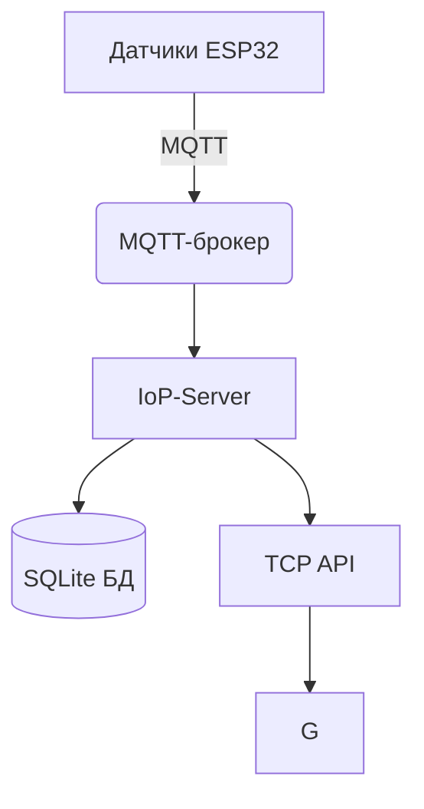

Ключевые возможности
- Сбор данных с ESP32-устройств в реальном времени
- Хранение в локальной БД (data.db) с историей показаний
- Интерфейс API на основе TCP и MQTT, включает:
    - Логирование в syslog и файлы (/var/log/)
    - Автозапуск через systemd



Также необходимо запустить mqtt-server(например mosquitto) на 1883, а также снять ограничения файервола.

Службы сервера:
- data.service (services/data_server_farm/) 
    - Подписывается на топик /farm$id$/data
    - Записывает данные от MQTT-брокера в БД(data.db)
- logger.service (services/farm_logger/)
    - Подписывается на топик /farm$id$/log
    - Записывает данные от MQTT-брокера в syslog
    - Для просмотра логов:
- logs.service (/services/logs_to_phone/)
    - Пересылает на мобильное устройство отчёт по всем показаниям фермы
    - Отправляются все отчёты, удовлетворяющие показателям "unix_time_from" - "unix_time_to"
    - В случае ошибок, неправильного формата, отправляется последняя запись
    - Для просмотра логов:
- config.service (/services/control_phone_config)
    - Принимает подключение от мобильного устройства, получает конфиг параметров сенсоров
    - Публикует в топик /farm$id$/config
- command.service (services/command_services)
    - Принимает подключение от мобильного устройства, получает команду, к-ую срочно нужно обработать на ферме
    - Публикует в топик /farm$id$/command
    
Просмотр логов одной конкретной службы:
```sh
journalctl -u $name$.service
```

Просмотреть статус + логи/добавление в автозагрузку/удаление/старт/остановка конкретной службы:
```sh
systemctl status/enable/disable/start/stop $name$.service
```

Сделать для всех служб сразу:
```sh
./farmctl status/enable/disable/start/stop
```
ВАЖНО!
Если службы НЕ РАБОТАЮТ/ОСТАНОВЛЕНЫ можно запустить вручную бинарные файлы(ОПАСНО):
В папке необходимой службы запускаем компиляцию(sh файл) и исполняем:
```sh
sh data.sh/logger.sh/logs.sh/config.sh/command.sh

# Без прикрепления к commandline в фоновом режиме
nohup DATA/LOGGER/LOGS/CONFIG/COMMAND &
```
Либо же централизовано в папке services компиляция + исполнение:
```sh
sh compile_and_run.sh
```
Удаление фоновых процессов:
```sh
sh delete_trash.sh
```


